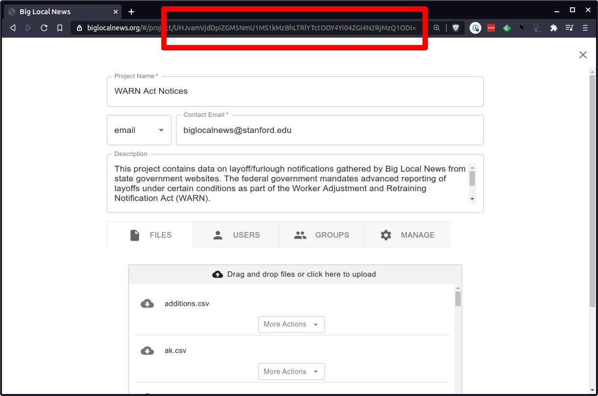
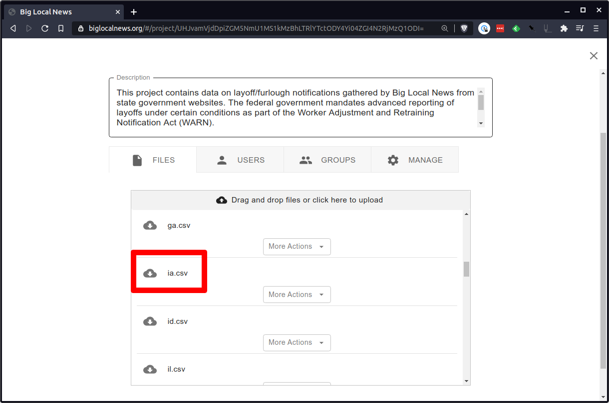
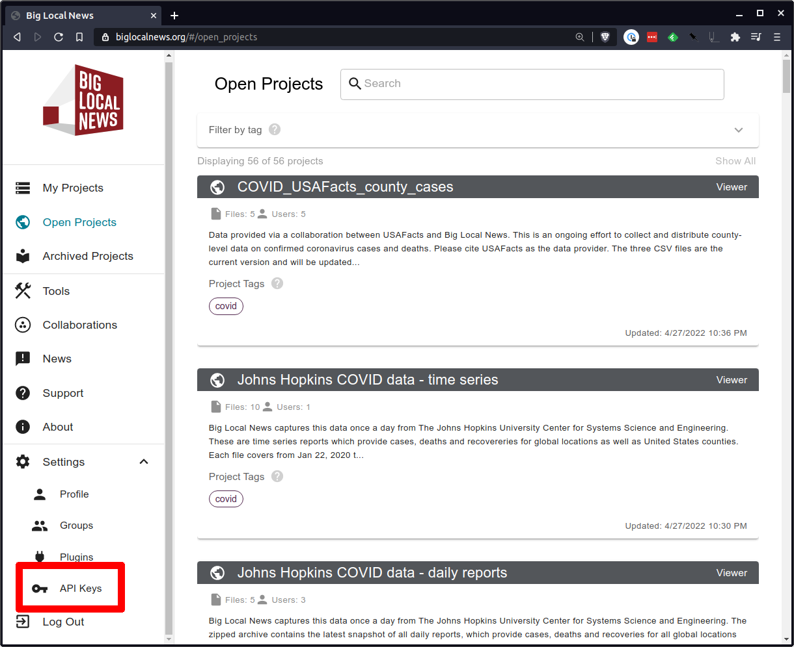

# pandas extensions

The `bln` package includes optional extensions to the [pandas](https://pandas.pydata.org/) data analysis library.

They can be easily imported into your environment. First import pandas as usual.

```python
from pandas import pd
```

Then:

```python
from bln.pandas import extensions
```

Your standard `pd` object now contains a set of custom methods for interacting with biglocalnews.org.

## Reading data

You can read in file from biglocalnews.org as pandas dataframes using the `read_bln` function. It requires three input: 

1. The unique identifier of the biglocalnews.org project where the file is stored
2. The name of the file within the biglocalnews.org project
3. An API key from biglocalnews.org with permission to read from the project.

```python
df = pd.read_bln(your_project_id, your_file_name, your_api_token)
```

You can find the project id by visiting the project on biglocalnews.org and pulling the long hash from the URL. Here's the [WARN Act Notices](https://biglocalnews.org/#/project/UHJvamVjdDpiZGM5NmU1MS1kMzBhLTRlYTctODY4Yi04ZGI4N2RjMzQ1ODI=) open project.



The name of the file can be found in the Files panel. Here's the Iowa data stored in `ia.csv`.



You can get an API key by visiting the link in the Settings menu.



If the token is set to the `BLN_API_TOKEN` environment variable, it doesn't have to be passed into the `read_bln` function.

Combine the entire example together and you can access the Iowa data file from the WARN Act Notices project with the following:

```python
import pandas as pd
from bln.pandas import extensions

project_id = "UHJvamVjdDpiZGM5NmU1MS1kMzBhLTRlYTctODY4Yi04ZGI4N2RjMzQ1ODI="
file_name = "ia.csv"
df = pd.read_bln(project_id, file_name)
```
